# Receipt-to-Health FYP Diagrams

This file contains Mermaid diagrams for the project documentation. You can paste each diagram into a Mermaid-supported editor, Markdown preview, or documentation tool.

## 1. Use Case Diagram

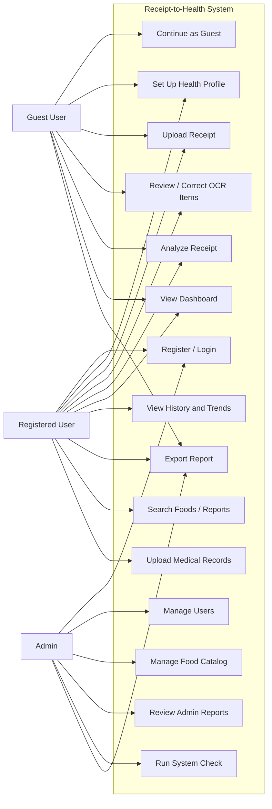

## 2. System Architecture Diagram

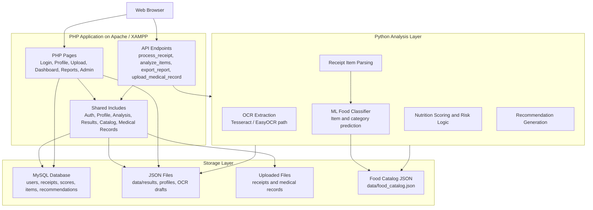

## 3. Data Flow Diagram Level 0

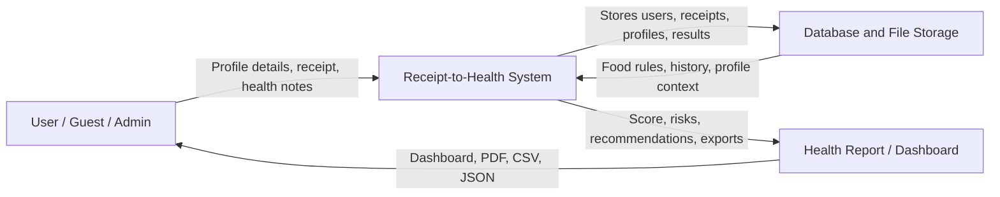

## 4. Data Flow Diagram Level 1

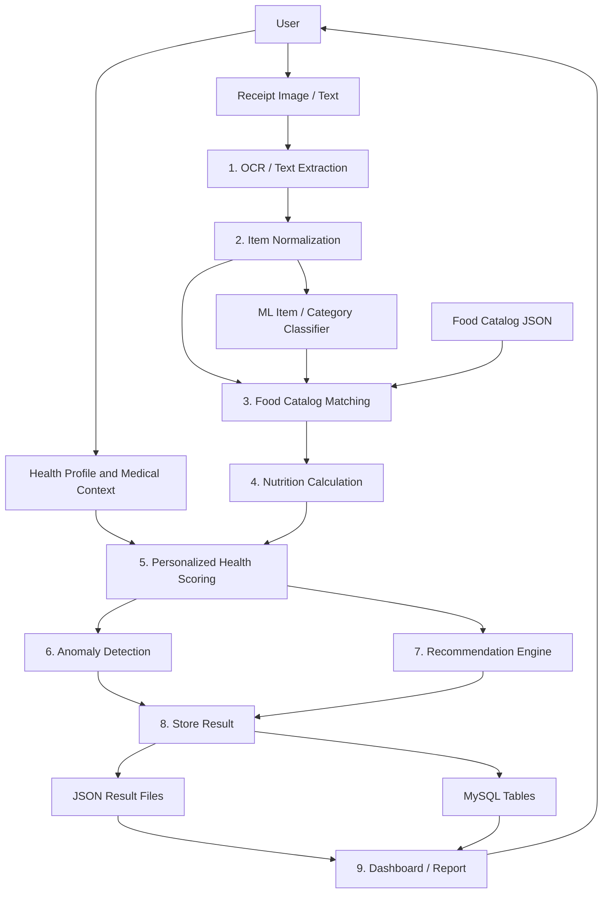

## 5. ER Diagram / Database Schema

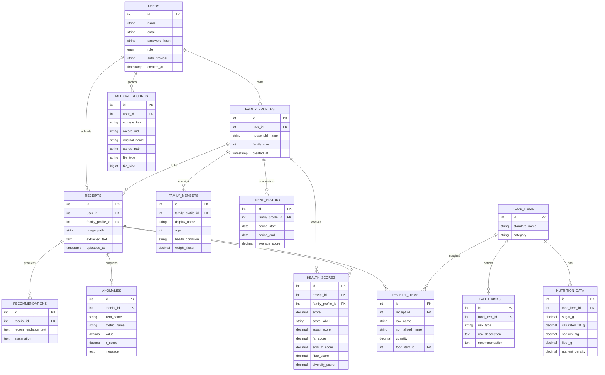

## 6. Activity Diagram - Receipt Analysis Flow

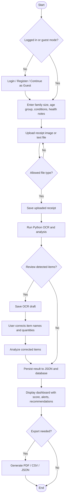

## 7. Sequence Diagram - Receipt Processing

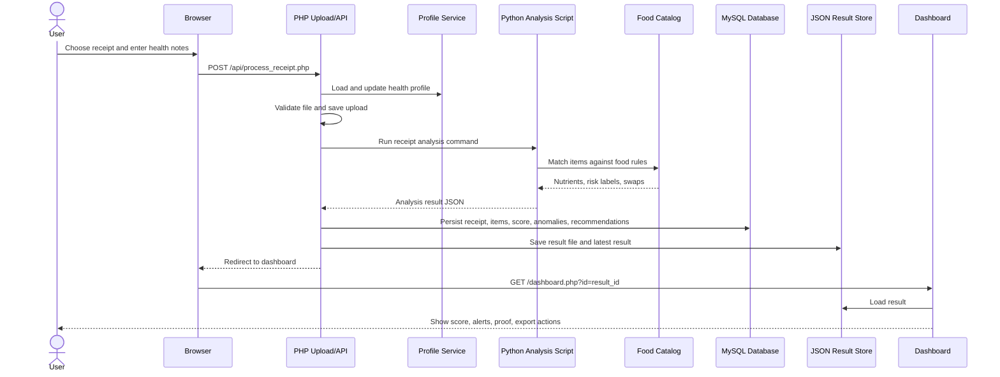

## 8. Admin Workflow Diagram

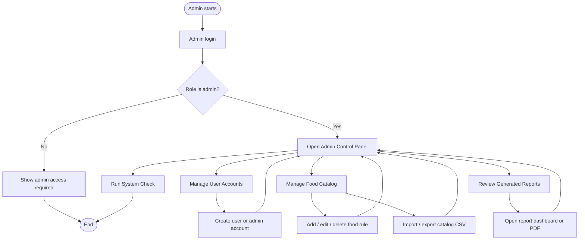

## 9. AI / Processing Pipeline Diagram

```mermaid
flowchart LR
    A["Receipt Input\nImage or Text"]
    B["OCR Extraction\nText from image"]
    C["NLP Parsing\nDetect food lines"]
    D["Normalization\nClean item names and quantities"]
    E["Knowledge Matching\nFood catalog aliases and categories"]
    M["ML Classification\nPredict item/category when alias match fails"]
    F["Nutrition Calculation\nSugar, sodium, saturated fat, fiber"]
    G["Personalized Scoring\nFamily size, age group, conditions"]
    H["Anomaly Detection\nUnusual or high-risk purchases"]
    I["Recommendation Engine\nActions and healthier swaps"]
    J["Explainable Output\nDashboard, proof, report export"]

    A --> B --> C --> D --> E
    D --> M --> E
    E --> F --> G --> H --> I --> J
```

## 10. Deployment Diagram

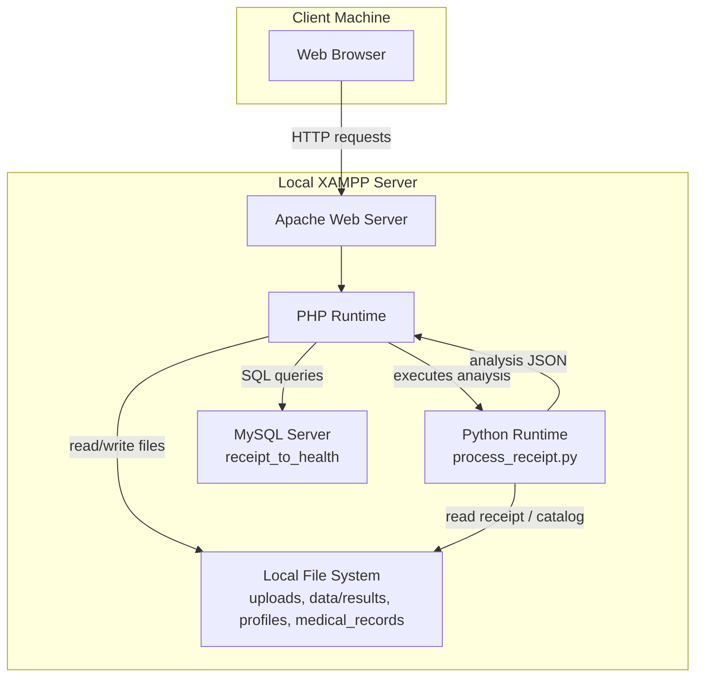

## 11. Navigation / Site Map Diagram

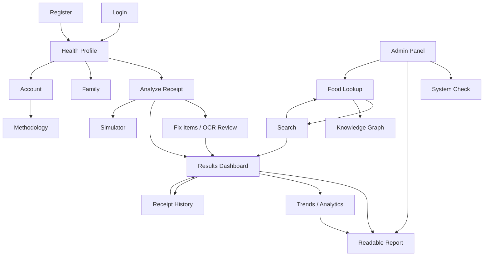

## 12. Report Generation Flow Diagram

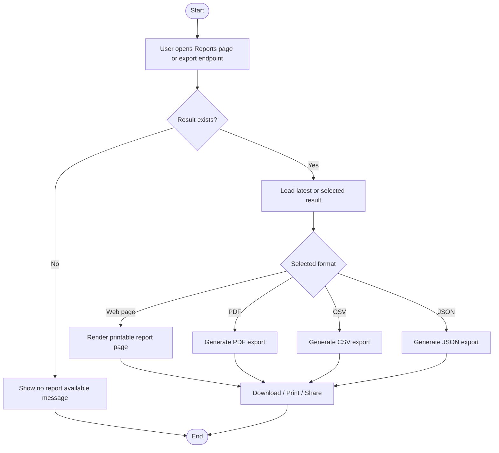
